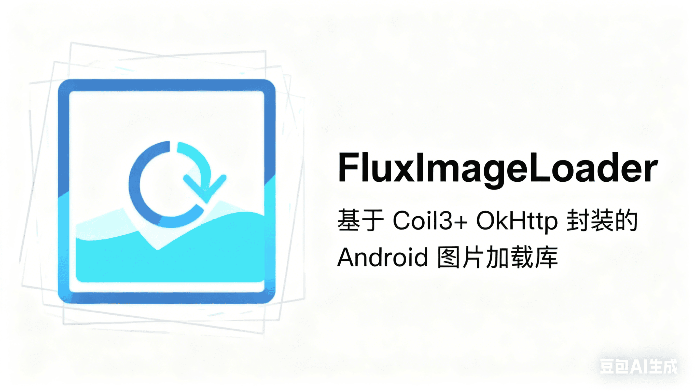

# FluxImageLoader

[](https://opensource.org/licenses/Apache-2.0)
[](https://jitpack.io/#darryrzhong/FluxImageLoader)


FluxImageLoader 是一个基于 [Coil3](https://coil-kt.github.io/coil/) + [OkHttp](https://square.github.io/okhttp/) 封装的 Android 图片加载库，旨在提供简单、高效且功能丰富的图片加载解决方案。

## 功能特性

- **基于 Coil3**: 享受 Coil3 带来的现代 kotlin图片加载体验。
- **多格式支持**: 支持常见图片格式以及 GIF、WebP 动图、SVG、视频帧解码。
- **自定义配置**: 支持自定义内存缓存、磁盘缓存大小及路径。
- **丰富变换**: 内置圆形、圆角、高斯模糊等常用图片变换。
- **预加载/下载**: 支持图片预加载到内存或仅下载到磁盘。
- **Java兼容**: 提供 `FluxLoader` 工具类，完美兼容 Java 调用。

## 接入指南

本文档提供了将 GalleryPicker 库集成到您的 Android 应用程序中的详细指南。

### 1. 添加依赖

在您的项目 `build.gradle` 文件中添加 JitPack 仓库和依赖项。

**根目录 `build.gradle`:**

```gradle
allprojects {
    repositories {
        ...
        maven { url 'https://jitpack.io' }
    }
}
```

**App 模块 `build.gradle`:**

```gradle
dependencies {
    implementation 'com.github.darryrzhong:FluxImageLoader:1.0.0' // 请检查最新版本
}
```


## 快速开始

### 1. 初始化

在 Application 的 `onCreate` 方法中进行初始化配置：

```kotlin
import com.flux.img.FluxImageLoader

class MyApplication : Application() {
    override fun onCreate() {
        super.onCreate()
        
        // 初始化配置
        FluxImageLoader.getInstance()
            .setMaxMemorySizePercent(0.25) // 最大内存缓存比例 (App可用内存百分比)
            .setMaxDiskSizePercent(0.02)   // 最大磁盘缓存比例 (用户可用磁盘百分比)
            .setDiskCacheFileName("coil_image_cache") // 磁盘缓存目录名称
            .debug(BuildConfig.DEBUG)      // 开启调试日志
            .init(this)
    }
}
```

### 2. 支持的格式

- **静态图片**: BMP, JPEG, PNG, WebP, HEIF (Android 8.0+)
- **动图**: GIF, WebP (Android 9.0+), HEIF (Android 11.0+)
- **SVG**: 支持 SVG 格式解码
- **视频**: 支持加载视频文件的第一帧或指定帧

## 使用指南 (Kotlin)

推荐使用 Kotlin 扩展方法进行调用，简洁高效。

### 基础加载

```kotlin
import com.flux.img.load

// 加载网络图片
imageView.load("https://www.example.com/image.jpg")

// 加载本地文件
imageView.load(File("/path/to/image.jpg"))

// 加载资源ID
imageView.load(R.drawable.ic_launcher)

// 设置占位图 (默认使用内置占位图，传 0 或不传使用默认)
imageView.load(url, placeholder = R.drawable.custom_placeholder)
```

### 图片变换

#### 圆形图片

```kotlin
import com.flux.img.loadCircle

imageView.loadCircle(url)
```

#### 圆角图片

```kotlin
import com.flux.img.loadRounded
import com.flux.img.transform.RoundedCornersType
import com.flux.loader.dp // 假设你有 dp 扩展，或者直接传 px 值

// 统一圆角
imageView.loadRounded(url, radius = 20f)

// 指定圆角位置 (例如：左上和右上)
imageView.loadRounded(url, radius = 20f, cornersType = RoundedCornersType.TOP)
```

#### 高斯模糊

```kotlin
import com.flux.img.loadBlur

// 基础高斯模糊 (默认模糊半径 10f)
imageView.loadBlur(url)

// 自定义模糊半径和圆角
// radius > 0: 圆角模糊
// radius < 0: 圆形模糊 (-1f)
imageView.loadBlur(url, blurRadius = 15f, radius = 20f)
```

### 动图加载

```kotlin
import com.flux.img.loadWebpAnim
import com.flux.img.loadGif

// 加载 WebP 动图 (Android 9.0+ 使用 Coil，9.0以下自动降级使用 Glide)
imageView.loadWebpAnim("https://www.example.com/anim.webp")

// 加载 GIF
imageView.loadGif("https://www.example.com/anim.gif")
```

### 获取 Bitmap / Drawable

当不需要直接显示在 ImageView 时使用。

```kotlin
import com.flux.img.loadBitmap
import com.flux.img.loadDrawable
import com.flux.img.listener.LoadListener

// 获取 Bitmap
imageView.loadBitmap(url, object : LoadListener<Bitmap> {
    override fun onSuccess(data: Bitmap) {
        // 处理 Bitmap
    }
    override fun onError(throwable: Throwable) {
        // 处理错误
    }
    // 可选: onStart(), onCancel()
})

// 获取 Drawable
imageView.loadDrawable(url, object : LoadListener<Drawable> {
    override fun onSuccess(data: Drawable) {
        // 处理 Drawable
    }
    // ...
})
```

### 预加载与下载

```kotlin
import com.flux.img.preload
import com.flux.img.preDownload

// 预加载到内存 (实现秒开)
preload(url, context)

// 预下载到磁盘 (不解码进内存，适合广告图等)
preDownload(url, context, object : LoadListener<Unit> {
    override fun onSuccess(data: Unit) {
        // 下载完成
    }
})
```

## 使用指南 (Java)

Java 代码请使用 `FluxLoader` 静态方法调用。

```java
import com.flux.img.FluxLoader;

// 基础加载
FluxLoader.load(imageView, url);
FluxLoader.load(imageView, url, R.drawable.placeholder);

// 圆形
FluxLoader.loadCircle(imageView, url);

// 圆角
FluxLoader.loadRounded(imageView, url, 20f);

// 高斯模糊
FluxLoader.loadBlur(imageView, url);

// 预加载
FluxLoader.preload(url, context);
```

## 资源释放

Coil 会自动管理资源释放，在以下情况自动取消请求：

- View 所在的 Lifecycle 进入 DESTROYED 状态
- View 被解绑 (Detached)

手动取消请求 (仅 Kotlin 扩展支持返回 Disposable):

```kotlin
val disposable = imageView.load(url)
disposable.dispose()
```

### 缓存清理

`FluxImageLoader` 提供了手动管理缓存的方法，建议在 `Application` 的生命周期回调中合理调用以优化内存使用。

```kotlin
// 清除内存缓存 (建议在 onLowMemory 中调用)
FluxImageLoader.getInstance().clearMemoryCache(context)

// 清除磁盘缓存
FluxImageLoader.getInstance().clearDiskCache(context)

// 整理内存缓存 (建议在 onTrimMemory 中调用)
FluxImageLoader.getInstance().trimMemoryCache(context)
```

示例 (在 Application 中):

```kotlin
override fun onLowMemory() {
    super.onLowMemory()
    // 系统内存紧张，立即清理内存缓存
    FluxImageLoader.getInstance().clearMemoryCache(this)
}

override fun onTrimMemory(level: Int) {
    super.onTrimMemory(level)
    when (level) {
        // App 切到后台，UI 不可见 || 后台 App 内存低
        ComponentCallbacks2.TRIM_MEMORY_UI_HIDDEN, ComponentCallbacks2.TRIM_MEMORY_BACKGROUND -> {
            FluxImageLoader.getInstance().trimMemoryCache(this)
        }
    }
}
```

## 注意事项

- `@DrawableRes` 资源建议直接使用 `setImageResource`，使用加载器会产生不必要的开销，除非需要做图片变换。
- 高斯模糊半径必须在 0-25 之间。
- 由于Coil3库仅支持在 Android API 28 以上加载动态 WebP 图片,如果需要在 Android API 28 以下加载动态 WebP 图片，请自行依赖 Glide 及其 WebP 解码库。

```kotlin
def GLIDE_VERSION = "5.0.5"
// webpdecoder
implementation "com.github.zjupure:webpdecoder:2.7.4.16.0"
// glide 4.10.0+
implementation "com.github.bumptech.glide:glide:${GLIDE_VERSION}"
kapt "com.github.bumptech.glide:compiler:${GLIDE_VERSION}"
```

## Proguard
```kotlin
-keep public class com.bumptech.glide.integration.webp.WebpImage { *; }
-keep public class com.bumptech.glide.integration.webp.WebpFrame { *; }
-keep public class com.bumptech.glide.integration.webp.WebpBitmapFactory { *; }

-keep class coil3.util.DecoderServiceLoaderTarget { *; }
-keep class coil3.util.FetcherServiceLoaderTarget { *; }
-keep class coil3.util.ServiceLoaderComponentRegistry { *; }
-keep class * implements coil3.util.DecoderServiceLoaderTarget { *; }
-keep class * implements coil3.util.FetcherServiceLoaderTarget { *; }
```

## Acknowledgments
- [Coil3](https://coil-kt.github.io/coil/)
- [Glide](https://github.com/bumptech/glide)
- [GlideWebpDecoder](https://github.com/zjupure/GlideWebpDecoder)