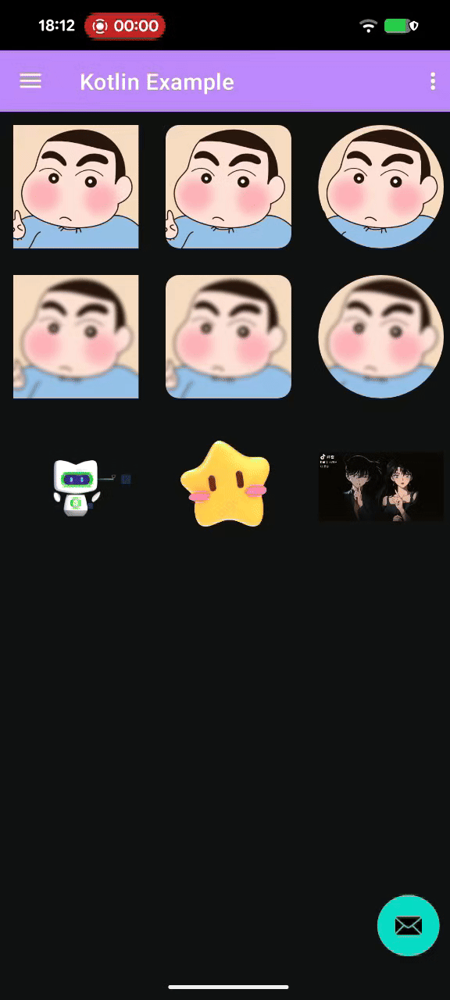

# FluxImageLoader

[](https://opensource.org/licenses/Apache-2.0)
[](https://jitpack.io/#darryrzhong/FluxImageLoader)

FluxImageLoader is an Android image loading library based on [Coil3](https://coil-kt.github.io/coil/) + [OkHttp](https://square.github.io/okhttp/), designed to provide a simple, efficient, and feature-rich image loading solution.

English | [简体中文](./README.zh_CN.md)

## Features

- **Based on Coil3**: Enjoy the modern Kotlin image loading experience provided by Coil3.
- **Multi-format Support**: Supports common image formats as well as GIF, animated WebP, SVG, and video frame decoding.
- **Custom Configuration**: Supports custom memory cache, disk cache size, and path.
- **Rich Transformations**: Built-in common image transformations such as circular, rounded corners, and Gaussian blur.
- **Preloading/Downloading**: Supports preloading images into memory or downloading them only to disk.
- **Java Compatibility**: Provides the `FluxLoader` utility class for perfect compatibility with Java calls.

## Installation Guide

This document provides a detailed guide on integrating the FluxImageLoader library into your Android application.

### 1. Add Dependencies

Add the JitPack repository and dependencies to your project's `build.gradle` file.

**Root `build.gradle`:**

```gradle
allprojects {
    repositories {
        ...
        maven { url 'https://jitpack.io' }
    }
}
```

**App Module `build.gradle`:**

```gradle
dependencies {
    implementation 'com.github.darryrzhong:FluxImageLoader:1.0.0' // Please check for the latest version
}
```

## Quick Start

### 1. Initialization

Perform initialization configuration in the `onCreate` method of your Application:

```kotlin
import com.flux.img.FluxImageLoader

class MyApplication : Application() {
    override fun onCreate() {
        super.onCreate()
        
        // Initialization configuration
        FluxImageLoader.getInstance()
            .setMaxMemorySizePercent(0.25) // Max memory cache ratio (Percentage of available app memory)
            .setMaxDiskSizePercent(0.02)   // Max disk cache ratio (Percentage of available user disk space)
            .setDiskCacheFileName("coil_image_cache") // Disk cache directory name
            .debug(BuildConfig.DEBUG)      // Enable debug logs
            .init(this)
    }
}
```

### 2. Supported Formats

- **Static Images**: BMP, JPEG, PNG, WebP, HEIF (Android 8.0+)
- **Animated Images**: GIF, WebP (Android 9.0+), HEIF (Android 11.0+)
- **SVG**: Supports SVG format decoding
- **Video**: Supports loading the first frame or specific frames of video files

<p align="center">
  
</p>

## Usage Guide (Kotlin)

It is recommended to use Kotlin extension methods for calls, as they are concise and efficient.

### Basic Loading

```kotlin
import com.flux.img.load

// Load network image
imageView.load("https://www.example.com/image.jpg")

// Load local file
imageView.load(File("/path/to/image.jpg"))

// Load resource ID
imageView.load(R.drawable.ic_launcher)

// Set placeholder (use 0 or do not pass to use default built-in placeholder)
imageView.load(url, placeholder = R.drawable.custom_placeholder)
```

### Image Transformations

#### Circular Image

```kotlin
import com.flux.img.loadCircle

imageView.loadCircle(url)
```

#### Rounded Corner Image

```kotlin
import com.flux.img.loadRounded
import com.flux.img.transform.RoundedCornersType
import com.flux.loader.dp // Assuming you have dp extension, or pass px value directly

// Uniform rounded corners
imageView.loadRounded(url, radius = 20f)

// Specify rounded corner positions (e.g., top left and top right)
imageView.loadRounded(url, radius = 20f, cornersType = RoundedCornersType.TOP)
```

#### Gaussian Blur

```kotlin
import com.flux.img.loadBlur

// Basic Gaussian blur (default blur radius 10f)
imageView.loadBlur(url)

// Custom blur radius and rounded corners
// radius > 0: Rounded corner blur
// radius < 0: Circular blur (-1f)
imageView.loadBlur(url, blurRadius = 15f, radius = 20f)
```

### Animated Image Loading

```kotlin
import com.flux.img.loadWebpAnim
import com.flux.img.loadGif

// Load animated WebP (Android 9.0+ uses Coil, below 9.0 automatically downgrades to use Glide)
imageView.loadWebpAnim("https://www.example.com/anim.webp")

// Load GIF
imageView.loadGif("https://www.example.com/anim.gif")
```

### Get Bitmap / Drawable

Use this when you don't need to display directly in an ImageView.

```kotlin
import com.flux.img.loadBitmap
import com.flux.img.loadDrawable
import com.flux.img.listener.LoadListener

// Get Bitmap
imageView.loadBitmap(url, object : LoadListener<Bitmap> {
    override fun onSuccess(data: Bitmap) {
        // Handle Bitmap
    }
    override fun onError(throwable: Throwable) {
        // Handle error
    }
    // Optional: onStart(), onCancel()
})

// Get Drawable
imageView.loadDrawable(url, object : LoadListener<Drawable> {
    override fun onSuccess(data: Drawable) {
        // Handle Drawable
    }
    // ...
})
```

### Preloading & Downloading

```kotlin
import com.flux.img.preload
import com.flux.img.preDownload

// Preload to memory (achieve instant open)
preload(url, context)

// Pre-download to disk (do not decode into memory, suitable for ads, etc.)
preDownload(url, context, object : LoadListener<Unit> {
    override fun onSuccess(data: Unit) {
        // Download complete
    }
})
```

## Usage Guide (Java)

For Java code, please use the `FluxLoader` static methods.

```java
import com.flux.img.FluxLoader;

// Basic loading
FluxLoader.load(imageView, url);
FluxLoader.load(imageView, url, R.drawable.placeholder);

// Circular
FluxLoader.loadCircle(imageView, url);

// Rounded corners
FluxLoader.loadRounded(imageView, url, 20f);

// Gaussian blur
FluxLoader.loadBlur(imageView, url);

// Preload
FluxLoader.preload(url, context);
```

## Resource Release

Coil automatically manages resource release and cancels requests in the following situations:

- The Lifecycle where the View is located enters the DESTROYED state
- The View is detached (Detached)

Manual request cancellation (only supported by Kotlin extensions returning Disposable):

```kotlin
val disposable = imageView.load(url)
disposable.dispose()
```

### Cache Cleaning

`FluxImageLoader` provides methods for manually managing cache. It is recommended to call them reasonably in the `Application` lifecycle callbacks to optimize memory usage.

```kotlin
// Clear memory cache (recommended to call in onLowMemory)
FluxImageLoader.getInstance().clearMemoryCache(context)

// Clear disk cache
FluxImageLoader.getInstance().clearDiskCache(context)

// Trim memory cache (recommended to call in onTrimMemory)
FluxImageLoader.getInstance().trimMemoryCache(context)
```

Example (in Application):

```kotlin
override fun onLowMemory() {
    super.onLowMemory()
    // System memory is low, clear memory cache immediately
    FluxImageLoader.getInstance().clearMemoryCache(this)
}

override fun onTrimMemory(level: Int) {
    super.onTrimMemory(level)
    when (level) {
        // App goes to background, UI invisible || Background App memory low
        ComponentCallbacks2.TRIM_MEMORY_UI_HIDDEN, ComponentCallbacks2.TRIM_MEMORY_BACKGROUND -> {
            FluxImageLoader.getInstance().trimMemoryCache(this)
        }
    }
}
```

## Notes

- It is recommended to use `setImageResource` directly for `@DrawableRes` resources. Using the loader will incur unnecessary overhead unless image transformations are needed.
- The Gaussian blur radius must be between 0-25.
- Since the Coil3 library only supports loading animated WebP images on Android API 28+, if you need to load animated WebP images on Android API below 28, please depend on Glide and its WebP decoder library yourself.

```kotlin
def GLIDE_VERSION = "5.0.5"
// webpdecoder
implementation "com.github.zjupure:webpdecoder:2.7.4.16.0"
// glide 4.10.0+
implementation "com.github.bumptech.glide:glide:${GLIDE_VERSION}"
kapt "com.github.bumptech.glide:compiler:${GLIDE_VERSION}"
```

## Proguard

```kotlin
-keep public class com.bumptech.glide.integration.webp.WebpImage { *; }
-keep public class com.bumptech.glide.integration.webp.WebpFrame { *; }
-keep public class com.bumptech.glide.integration.webp.WebpBitmapFactory { *; }

-keep class coil3.util.DecoderServiceLoaderTarget { *; }
-keep class coil3.util.FetcherServiceLoaderTarget { *; }
-keep class coil3.util.ServiceLoaderComponentRegistry { *; }
-keep class * implements coil3.util.DecoderServiceLoaderTarget { *; }
-keep class * implements coil3.util.FetcherServiceLoaderTarget { *; }
```

## Acknowledgments

- [Coil3](https://coil-kt.github.io/coil/)
- [Glide](https://github.com/bumptech/glide)
- [GlideWebpDecoder](https://github.com/zjupure/GlideWebpDecoder)
